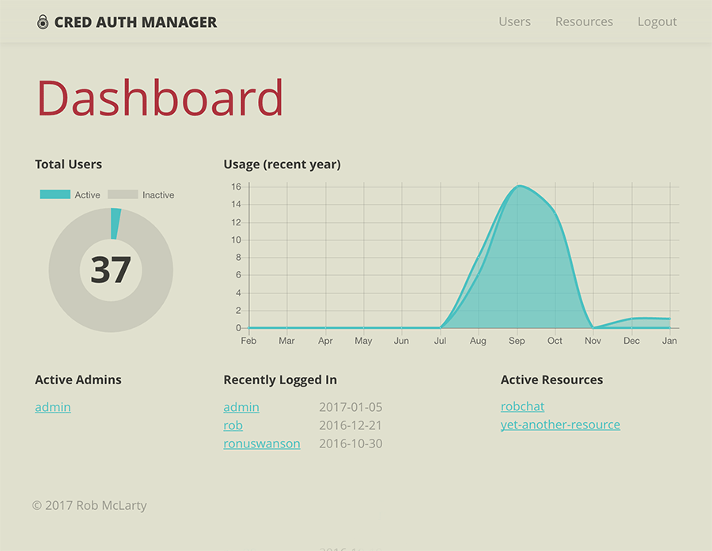

# Cred Auth Manager



An Express-based centralized auth management system for handling user accounts
and setting their permissions to be used across multiple independent resource
APIs by exchanging JSON Web Tokens for valid cred(entials).

## Huh?

All apps need some concept of "users", and those users usually have some method
of "logging in" (exchanging credentials for application-specific access tokens),
and each user may (or may not) have disparate permissions (e.g., an admin user
might have more power than a regular user). This package abstracts these
problems away from your app so you don't have to worry about them. Just make
your app-specific stuff, and let cred-auth-manager handle user accounts and auth.

You can also do stuff like group users together into categories/labels and
enable users' management of friendships/relationships from themselves to other
users in the system. It's up to you what you'd like to do with that (or not use
it at all).

Authorization is per-resource. So you have controls that can enable you to use
a single installation of cred-auth-manager handle auth for multiple different
apps that you are developing so you can have all your user-stuff in one place.
Or you can install it alongside (or inside) each of your apps if you want each
of your apps to have its own set of user-stuff.

It includes a graphical user interface, made with React, to administer the
database and adjust settings for your app(s).

The server itself has no front-end. It is a simple JSON API. But the React app
accesses its interface and enables a UI for changing settings. Your
customer-facing apps can access the API in the same way this React app does
using the JSON API to login, get tokens, and manage settings.

## Why?

I'm always needing to do the same things over and over in every app I make:
dealing with users, their accounts, how they login, what permissions they have,
what they have access to do (or not do), and grouping them together in different
ways. cred-auth-manager just abstracts these problems into a single package
that I can depend on using revisions such that all my apps can be upgraded
together when I want to change/fix/upgrade aspects of my user-management flow.

This is a toolbox to help give your apps powerful auth tools. It's not meant to
be the right solution for all situations. It's a certain type of solution that
may be useful to the way you're working.

## Install

You can use cred-auth-manager in three different ways:

1. Make a new app and include cred-auth-manager inside it.
2. Make a mini app that simply launches cred-auth-manager *beside* your app.
3. Run it as a Docker container micro-service on its own.

`npm install cred-auth-manager`

## Usage

### NPM Module

```javascript
const express = require('express')
const createApp = require('cred-auth-manager')

const app = createApp({
  express,
  issuer: 'my-app-name',
  database: 'postgres://localhost:5432/my-db-name',
  accessPrivKey: '/path/to/private/key',
  accessPubKey: '/path/to/public/key',
  refreshSecret: 'my_super_secret_secret'
})

app.use('/custom/path', (req, res, next) => {
  res.json({
    ok: true,
    message: 'It worked!'
  })
})

app.listen(3000, err => {
  if (err) return console.log('ERROR: ', err)

  console.log('Server started on port 3000')
})
```

### Docker Container

...documentation coming soon

## License

MIT

## Acknowledgements

[Cred](https://github.com/robmclarty/cred)
